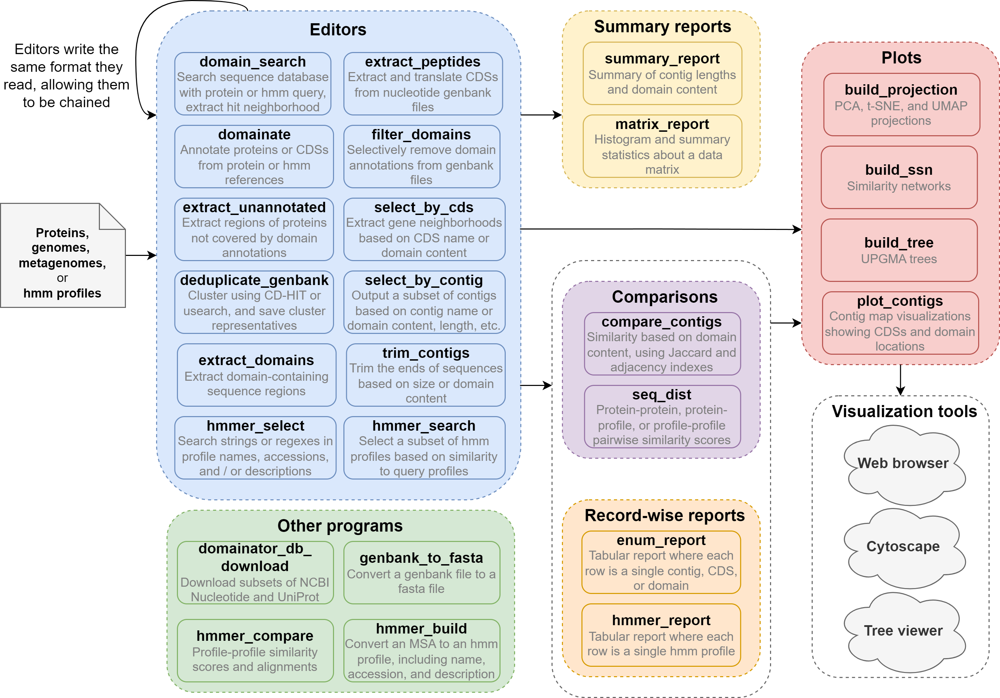
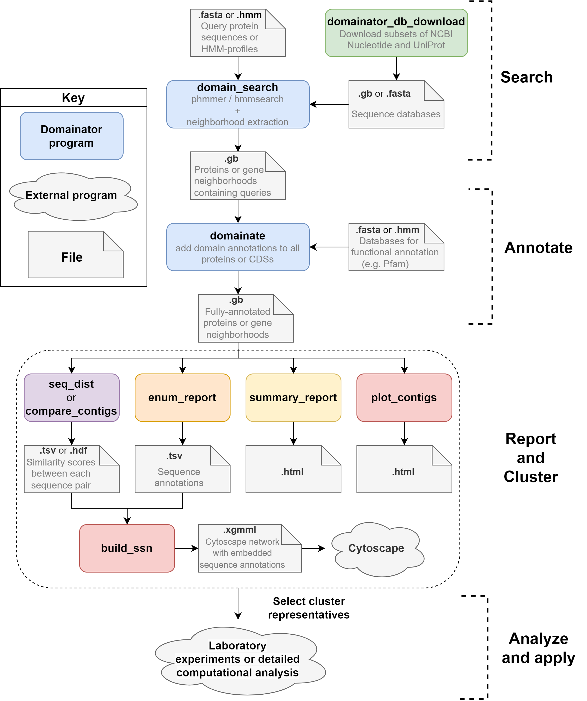
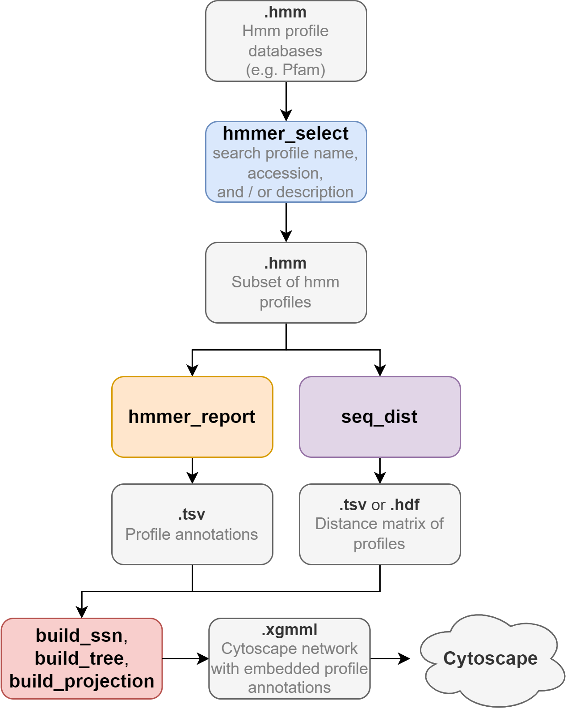

# Domainator
Version 0.7.1

[//]: # (remember to update version in domainator/__init__.py also)

A flexible and modular software suite for domain-based gene neighborhood and protein search, extraction, and clustering.

# Contents
 - [Overview and key concepts](#Overview-and-key-concepts)
 - [Program descriptions](#Program-descriptions)
 - [Requirements](#Requirements)
 - [Installation](#Installation)
   - [Conda](#Conda)
   - [Apptainer (Singularity)](#Apptainer-(Singularity))
 - [Updating](#Updating)
 - [Examples](#Examples)
 - [Using Domainator as a python library](#Using-Domainator-as-a-python-library)
 - [Credits](#Credits)

## Detailed documentation
- [Index](docs/README.md)
  - [File Formats](docs/file_formats.md)
  - [Basic Examples](docs/examples.md)
    - [As a Google Colab notebook](https://colab.research.google.com/github/nebiolabs/domainator_examples/blob/main/colab_notebooks/Domainator.ipynb)
  - [Advanced examples](https://github.com/nebiolabs/domainator_examples)
  - [Developing Domainator](docs/developing_domainator.md)
  - [ESM-2 3B 3Di and foldseek integration](docs/esm_3b_foldseek.md)
  - [Limitations and frequently asked questions](docs/limitations_and_FAQ.md)

# Questions, comments, bug reports, and feature requests
Please use our [discussions page](https://github.com/nebiolabs/domainator/discussions) or [create an issue](https://github.com/nebiolabs/domainator/issues)

# Overview and key concepts

Domainator provides several dozen discrete, flexible programs that can be composed into a broad range of workflows via command line or python scripting. Domainator also treats HMM-profiles as first-class citizens, supporting subsetting of .hmm files and comparison of HMM-profiles, including the construction of profile similarity networks and trees.

Domainator uses the GenBank file format as a carrier of both sequence and annotation data. Independence from a fixed set of sequence sources and the co-location of sequences and all their annotation data in a single file increases data portability and decreases complexity for end-users. Domainator can add functional annotations to sequences by comparison either to HMM-profiles, protein sequences, or both at the same time. For example, in a single call to domainate, a set of genome or metagenome contigs can be annotated with hits to Pfam HMM-profiles and hits to REBASE Gold Standard protein sequences at the same time.

The individual programs that make up Domainator can be roughly classified into six categories corresponding to their typical roles in workflows. The first steps in most workflows typically involve passing sequence data through one or more editors.

__Editors__ are programs whose output format is the same as their input format. Each individual editor performs a simple task, but they can be combined in arbitrarily long chains to accomplish complex transformations. Examples are domain_search, which outputs a subset of the input sequences, based on the presence of a hit to a reference sequence or profile; domainate, which outputs all the input sequence but adds domain annotations based on hits to reference sequences; deduplicate_genbank, which performs similarity clustering using CD-HIT  or usearch  and outputs only the cluster representatives input sequences; and select_by_cds, which extracts genome neighborhoods around domains of interest. 

__In Domainator programs, perhaps differently from other software, the file being edited is supplied via the `-i` argument and criteria for editing is supplied via other arguments, such as the `-r` argument for reference sequences or hmm profiles. For example searching for hits to a query in the UniProt database may be accomplished via `domain_search.py -i uniprot.fasta -r query.hmm -o hits.gb`, similarly annotating a set of contigs with Pfam annotations may be accomplished with `domainate.py -i unannotated.gb -r pfam-A.hmm -o annotated.gb` .__

__Summary report programs__ summarize data into graphs and statistics, for example, the number of sequences in a file and the count of each kind of domain. Record-wise report programs produce tab-separated files, for example where each row corresponds to a genome contig, a protein, or a domain, and values are data such as length, taxonomy ID, domain content, etc. 

__Record-wise reports__ are useful for exporting data to programs, such as Excel, which can’t read GenBank or hmm files, and they also find use as intermediary files between some programs in Domainator.

__Comparison programs__  generate pairwise score or distance matrices between contigs or HMM-profiles. Compare_contigs uses the Jaccard  and adjacency  indexes to compare proteins or gene neighborhoods based on their domain content, whereas seq_dist uses local alignment scores, for example via phmmer , Diamond , hmmsearch , or the Viterbi profile-comparison algorithm. Comparison programs output data matrices.

__Plotting programs__ convert data into formats appropriate for graphical visualization, for example converting score matrices and tabular metadata into trees or similarity networks which can be viewed in Cytoscape  or other external visualization tools, depending on the data type.

Finally, there are few programs that defy categorization, these programs perform functions such as downloading data from NCBI or UniProt, converting files between formats, or generating profile-profile alignments.

## Overview of Domainator components

*not all programs are shown

## Example genome mining workflow



## Example HMMER profile comparison workflow




# Program descriptions

For detailed documentation for each program, call the program with the `-h` option.

Programs that can accept streaming input will read genbank formatted data from `stdin` when not supplied with an explicit input. Programs that need to pass over the input multiple times can't support streaming input.
Programs that can produce streaming output will write genbank formatted data to `stdout` when not supplied with an explicit output. 
You can use shell pipes to move data from a program that supports streaming ouput into a program that supports streaming input (but note that it is more efficient to use domainator as a python library, see below).

| Program | Description | input |  output  | streaming input  |  streaming output  |  notes  |
| ---- | ----- | ---- |---| -- | -- | ------------- |
|  build_projection.py | generates 2d or 3d umap, tsne, or pca projections | a dense or sparse data matrix, could be a sequence similarity matrix, or any other kind of data matrix. optionally, a table of node metadata. |  typically a Cyoscape xgmml file or a png image file. Other outputs are possible.  |  no  |  no  | |
|  build_ssn.py |  generates a Cytoscape file with a sequence similarity network (SSN)  |  a sparse matrix of network edges. optionally, a table of node metadata  |  typically a Cyoscape xgmml file, other SSN related files are possible | no  | no  | |
|  build_tree.py | Converts a distance matrix into a UPGMA tree |  a distance matrix  | Newick or Cytoscape file  | no  | no  | Can attach annotations to cytoscape files, based on supplied metadata. |
|  color_genbank.py  |  creates color qualifiers on CDS and/or domainator features based on domainator annotations |  domainator-annotated genbank files. optionally a tab-separated map of domain names to hex colors.  | a genbank file | yes | yes | To auto color most domains but give explicit colors to some, run twice. First without a tsv map, then with a tsv map. |
| color_table_to_legend.py | Generates an SVG legend based on a color table | tab separated file of annotation names and color codes | an svg file | no | no |  |
|  compare_contigs.py |  calculates similarities between contig, based on metrics such as domain adjacency index and domain jaccard index.  | domainator-annotated genbank files | Genbank file where contigs are sorted according to hierarchical clustering of similarity. sparse or dense similarity matrices.  |  no  |  no  | If you want to pipe genbank output you can explicitly supply `-o -`. Other kinds of output planned for the future, such as phylogenetic trees of contigs. |
|  deduplicate_genbank.py |  runs a clustering algorithm, such as cdhit or usearch on sequences from a genbank file to reduce redundancy.  | genbank nucleotide or peptide files  |  a genbank file  |  no  | yes |  |
|  domain_search.py | Search a small number of hmms against a database | genbank (protein genbank, or nucleotide genbank with CDS annotations) or protein fasta files to search through.  hmmer3 hmm (or peptide fasta) files to search for in the sequences.  |  a genbank file  |  no  | yes |   |
|  domainate.py  | annotates contig or protein sequences with protein domains   | genbank (protein genbank, or nucleotide genbank with CDS annotations) or protein fasta files to annotate.  hmmer3 hmm (or peptide fasta) files to search for in the sequences. | a genbank file with new annotations | no | yes | Consider `domain_search.py` if searching for small numbers of hmms against large databases.  |
|  domainator_db_download.py | Download databases from the internet in formats appropriate for domainator  |  None | genbank or fasta  | N/A  | use `-o /dev/stdout` |  |
|  enum_report.py | from a genbank file generates a tab separated file of properties and metadata related to the input, for example the domain content of each contig or cds. | genbank files | a tab separated or html metadata table  | yes | yes |  |
|  extract_domains.py | Takes a domainator-genbank file, looks for the specified domains, and extracts them from the contigs.  |  a (nucleotide or peptide) genbank file.  |  a genbank or fasta file of the same sequence-type (nucleotide or peptide) as the input  | yes  |  yes  | If you want to extract peptide domains from a nucleotide genbank, pass the output of this program into extract_peptides (or vice-versa) |
|  extract_peptides.py | extracts translated peptide sequences from nucleotide genbank sequences, preserves the domainator annotations (other annotations are lost) |  nucleotide genbank file  |  peptide genbank file  | yes  | yes | |
|  extract_unannotated.py | Takes a domainator-genbank file, extracts regions not covered by any domain annotations  |  a peptide genbank file.  |  a peptide genbank or fasta file  | yes  |  yes  |   |
|  filter_domains.py  |  applies more stringent filtering to domainator-annotated genbank files.  |  domainator-annotated genbank files  |  a genbank file  |  yes  | yes  | If you want to annotate the same genbank file with multiple evalue or max_overlap cutoffs, it is often faster to run domainator.py first with loose cutoffs, then run filter_domains.py with more stringent cutoffs. To clear all annotations, just run `filter_domains.py` with an evalue of `-1`|
|  genbank_to_fasta.py | converts genbank files to fasta files  | one or more genbank files  | a fasta file | yes  | yes  |  |
|  hmmer_build.py | runs hmmbuild. Unlike the hmmbuild from the HMMER3 package, hmmer_build.py allows specifying accession and description from the command line | an MSA | a .hmm file  | no  | no  |  |
|  hmmer_compare.py |  runs local profile alignment, calculating pairwise hmm scores and position-wise alignments |  hmmer3 profiles  |  scores and (optionally) alignments |  yes |  no  | hmmer_compare, hmmer_search, and seq_dist can all be used to compare profiles, with different outputs. |
|  hmmer_report.py |  Writes a tabular report from .hmm files, with a line for each profile | one or more .hmm files | a tab separated or html metadata table | yes  | yes  |  |
|  hmmer_search.py |  Selects hmm profiles based on similarity scores to a reference set of hmm profiles |  hmmer3 profiles  |  hmmer3 profiles |  yes |  yes  | hmmer_compare, hmmer_search, and seq_dist can all be used to compare profiles, with different outputs. |
|  hmmer_select.py | Extracts a subset of profiles from .hmm files  | one or more .hmm files  | an hmm files  | yes  | yes  |  |
|  matrix_report.py | generates a histogram and summary statistics from a data matrix | a dense or sparse data matrix | a report with graphics and statistics | no | no |  |
|  partition_seqfile.py | Scans through a genbank or fasta file and finds file byte offsets to partition the file into subsets. | a genbank or fasta file  |  tab separted text `offset, recs`  | no | yes | This is useful for parallelizing searches, in combination with the `--offset` and `--recs_to_read` parameters of `domainate.py` and `domain_search.py` |
|  plot_contigs.py | Creates graphical representations of contigs with their annotations. | a genbank or fasta file  | an html file | yes | no | |
|  select_by_cds.py |  Extract contigs or contig regions based on CDS names or domain content within individual CDSs | domainator-annotated nucleotide genbank files  |  a genbank file  |  yes |  yes  | Supports boolean logic for domain selector statements. If `--pad` option is set, then output streaming is not in real-time and memory usage will be higher, because all records need to be read before padding sizes can be calculated.  |
|  select_by_contig.py | Extract a subset of contigs based on domain content of the entire contig | domainator-annotated genbank files  |  a genbank file | yes |  yes  | Supports boolean logic for domain selector statements. |
|  seq_dist.py | calculates similarity scores between protein sequences |  two peptide sequence files (genbank or fasta), a sequence file and an hmm file, or two hmm files.  |  a sparse or dense matrix of similarity scores  | no  |  no  |  Typically the input and reference will be the same sequence file, creating a pairwise similarity matrix. It can also use an hmm file as a reference to make a table of profile scores for each input peptide. |
|  summary_report.py |  Calculates statistics such as number of contigs, average contig length, and frequency of each domain   |  a domainator-annotated genbank file  |  an html file of the report, with figures, statistics etc |  yes  |  no  |  'focus domains' can be specified, which will make the output include information about the co-occurrence and distance of those domains with other domains. Can also write a report to the console. |
|  transform_matrix.py | Converts matrices in score format to matrices in various normalized score formats  |  a dense or sparse data matrix of scores  | a dense or sparse data matrix of normalized scores  |  no  |  no  |  |
|  trim_contigs.py | trim the ends of contigs | nucleotide or protein genbank or fasta files |  a genbank file  |  yes |  yes  | Supports boolean logic for domain selector statements. |
|   |   |   |   |   |   |  |


# Requirements

Domainator is developed on Linux, and has been tested on Mac. It probably won't work on Windows, except through WSL.

# Installation

__NOTE:__ For Installation with ESM-2 3B 3Di and foldseek integration, see [here](docs/esm_3b_foldseek.md)

## Conda

### Step 0: Install miniconda
If you don't already have a conda distribution installed, install one, such as miniconda.

[Miniconda](https://docs.conda.io/en/latest/miniconda.html)

or

[Mambaforge](https://github.com/conda-forge/miniforge#mambaforge)

### Step 1: Download, extract, and install the domainator package

Go to the [Domainator github page](https://github.com/nebiolabs/domainator) and download and extract the zip file for the latest release (see the right side of the github page), or download it via `git clone`.

Extract the zip file. In a terminal, navigate to the newly extracted folder and install the package with the command:

```bash
conda env create -f conda_env.yml
```

This will create a new conda environment called "domainator".

### Step 2: Activate the environment before you install packages or run any script
```bash
conda activate domainator
```

## Apptainer (Singularity)

Navigate to the directory containing this README file. It should also contain a file called `apptainer.def`. In that directory execute the command:

```bash
apptainer build domainator.sif domainator.def
```

Or (if you have singularity not apptainer)

```bash
singularity build domainator.sif domainator.def
```

Then to execute domainator commands, prefix any command with 
```bash
apptainer exec domainator.sif [command here]
# for example:
apptainer exec domainator.sif domainate.py -i test/data/pDONR201_multi_genemark.gb -r test/data/pdonr_hmms.hmm -o example_out.gb
```

# Updating

Download and extract the new version, navigate to the folder and install with:

```bash
conda env create --yes -f conda_env.yml
```

This will delete the old `domainator` conda environment and replace it with the updated version.

# Examples

## Run Domainator to annotate contigs with Pfam

Activate the domainator conda environment
```bash
conda activate domainator
```

To run domainator on a single file
```bash
# download and extract Pfam
wget https://ftp.ebi.ac.uk/pub/databases/Pfam/current_release/Pfam-A.hmm.gz
gunzip Pfam-A.hmm.gz

# run Domainator
domainate.py --cpu 4 --max_overlap 0.6 -i your_genbank.gb -r Pfam-A.hmm -o domainator_output.gb
```

## Visualizing output
```bash
summary_report.py -i domainator_output.gb --html domain_summary.html
enum_report.py -i domainator_output.gb --by contig --name --taxname superkingdom genus species self --length --domains --html enum_report.html -o enum_report.tsv
plot_contigs.py -i domainator_output.gb --html contigs_plot.html
```

For more examples see: [Basic Examples](docs/examples.md), and [Advanced examples](https://github.com/nebiolabs/domainator_examples).

# Using Domainator as a python library

## Basics
Most executables in Domainator are based on a core function that acts as a editors on BioPython SeqRecord objects. So you can chain them within python scripts, keeping sequences as SeqRecords instead of writing and reading Genbank files.
Chaining the functions will be similar to piping the output of one program to another, but will be faster because superfluous conversions from Genbank to SeqRecord and back again will be avoided. A caveat is that you lose some input and output validation (See also [Interoperability with BioPython](#Interoperability-with-BioPython)). 

The general way to access these functions is `from domainator.[script_name] import [script_name]`. 

## Interoperability with BioPython

Domainator is not directly intercompatible with BioPython. It uses `SeqRecord` objects derived from BioPython `SeqRecords`, but with some changes and extensions. A modified and extended subset of BioPython is included with Domainator as `domainator.Bio`. For reading and writing domainator-compatible sequence files we strongly recommend using the `domainator.utils.parse_seqfiles` and `domainator.utils.write_genbank` functions, respectively.

# Credits

## Please cite
Johnson, Sean R., Peter Weigele, Alexey Fomenkov, Andrew Ge, Anna Vincze, James B. Eaglesham, Richard J. Roberts, and Zhiyi Sun. “Domainator, a Flexible Software Suite for Domain-Based Annotation and Neighborhood Analysis, Identifies Proteins Involved in Antiviral Systems.” 2024, _Nucleic Acids Research_, gkae1175. [https://doi.org/10.1093/nar/gkae1175](https://doi.org/10.1093/nar/gkae1175).


## Projects that domainator draws inspiration from
  - [BigScape/Corason](https://bigscape-corason.secondarymetabolites.org/)
  - [EFI](https://efi.igb.illinois.edu/)
  - [pydna](https://github.com/BjornFJohansson/pydna)
  - [antiSMASH](https://github.com/antismash/antismash)
  - [HMMER3](https://github.com/EddyRivasLab/hmmer)
    - [pyHMMER](https://github.com/althonos/pyhmmer)

## Contributors
 - Sean Johnson 
 - Peter Weigele
 - Zhiyi Sun 
 - Andrew Ge
 - Yu-Cheng Lin

