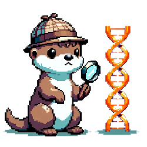

# Limitations
## Large reference databases
Domainator currently loads reference databases into memory, so it is not suitable for large reference databases, for example it is suitable for annotating using Pfam as a reference with ~30,000 profiles, but not NCBI nr with millions of sequences.

## Contigs vs genomes
A major limitation of Domainator is that it operates on the contig level, not the genome level. So for example, when reporting taxonomy, fragmented genome assemblies will be counted multiple times, once for each contig in the assembly.

## Scores and E-values
Domainator uses scores and evalues somewhat inconsistently. Some programs allow filtering by evalue, others allow filtering by local alignment scores. It would be nice to be more consistent about that. Also domainator evalues are typically not adjusted by database size. Z = 1000 by default in most cases. One possible solution could be to stop using evalues and scores all together, and do most operations in the space of EFI scores.

## plot_contigs.py handling of large contigs and large lists of contigs

plot_contigs.py output looks best when the contigs are of sizes in the range of kb to 10s of kb, and when there are a fewer than about 300 of them.

For whole genomes, [genome_notebook](https://github.com/dbikard/genomenotebook) might work better.

[Geneious Prime](https://www.geneious.com/) works very well for visualizing Domainator annotations, but is commercial software.

We welcome any other recommendations for contig visualization software.

# Frequently asked questions

## What's with all the otters?
   The Domainator mascot is Domainic, the Domain-otter. Domainic is a American river otter. Besides the irresistible pun and cuteness, the choice of an otter mascot was inspired by the river otters that live in the pond on the New England Biolabs Ipswich campus, where most of Domainator was written. You may see Domainic throughout our documentation, donning his detective gear as he investigates new proteins and genome neighborhoods. The otters holding hands as the M in our logo are a metaphor for a multidomain protein. Similar to the domains of many two-domain proteins, the individual otters are connected by a flexible linker, and can function independently when separated, but are happiest when they are together. While river otters are not known to hold hands, it's sea otters that exhibit that behavior, we hope you'll forgive our creative license in incorporating hand holding river otters into our logo.
## Can Domainator handle eukaryotic genomes with introns in their CDSs?
   Yes! Domainator can add domain annotations across introns and process those files just the same as files without introns. Input files must be in genbank format, and the gene must annotated as a CDS with a complex location, for example `join(11356..11374,11523..17083)`. One potential complication is that eukaryotic genome annotations often include multiple gene models for the same gene. Domainator considers these to be distinct CDSs, so tools like `domain_search.py` and `select_by_cds.py` may behave in unexpected ways, extracting redundant hits, or smaller neighborhoods than expected. If possible, select non redundant representative gene models and delete others from the GenBank file before using it as input to Domainator. If there is enough demand, we will consider adding automated tools to Domainator for better handling of alternative gene models.
