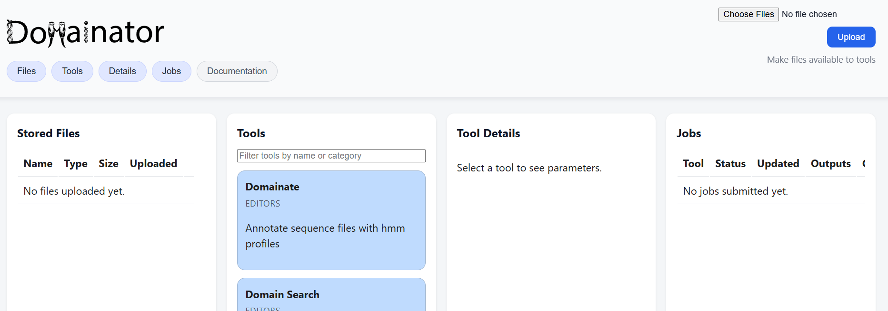

# Domainator GUI

[Docs Home](../../README.md)

## Quickstart

In the console.
```
conda activate domainator
domainator_server 
```

It will give you an address, for example:

`http://127.0.0.1:44651`

You can copy that into your web browser to get a page that looks like:



## Getting some profiles

Download and unzip the Pfam hmm profiles.

[https://www.ebi.ac.uk/interpro/download/Pfam/](https://www.ebi.ac.uk/interpro/download/Pfam/)

Upload them to your Domainator GUI by dragging the file to "Choose Files" in the top right, or clicking "Choose Files" and then navigating to the location of the Pfam file.

You can also download individual Pfam profiles from their profile page, for example:
[https://www.ebi.ac.uk/interpro/entry/pfam/PF24174/logo/](https://www.ebi.ac.uk/interpro/entry/pfam/PF24174/logo/)  

## Getting sequences

Domainator can operate on Fasta files or GenBank files.

One way to get sequence files is with the `Domainator DB Download` app.

## Example genome mining workflow


## Example HMMER profile comparison workflow


## Additional examples

You can follow along in the GUI with the command line examples:

- [Basic](../examples.md)
- [Advanced](https://github.com/nebiolabs/domainator_examples)


## Advanced command line options for server application
```
domainator_server [-h] [--port PORT] [--host HOST] [--data-dir DATA_DIR] [--schema-dir SCHEMA_DIR] [--debug]

Start the Domainator web server

options:
  -h, --help            show this help message and exit
  --port PORT           Port to bind the server. By default, a random free port is chosen. (default: 0)
  --host HOST           Host interface to bind. Defaults to localhost. To make the server accessible on the network, use
                        0.0.0.0 (default: 127.0.0.1)
  --data-dir DATA_DIR   Data directory for uploads, jobs, and logs. Defaults to /home/sean/domainator_server (default: None)
  --schema-dir SCHEMA_DIR
                        Directory containing tool and workflow schema JSON files (default: None)
  --debug               Enable Flask debug mode (default: False)
```
